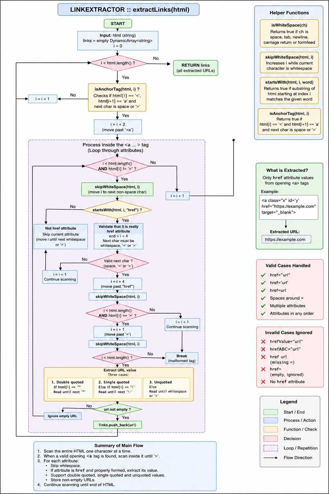
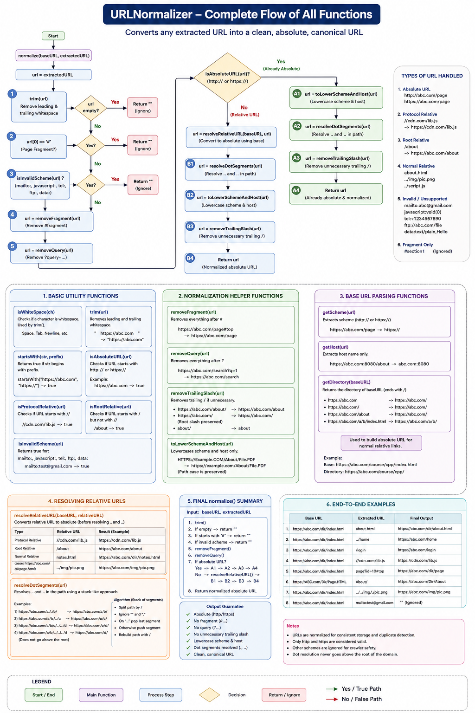

**Module:** PageStorage, Link Extractor & URL Normalizer Implementation
**Date:** 20-07-2026

---

# Section 1 — Specific Bug

## Bug 1 — PageStorage did not preserve page count after restart

### Runtime Behaviour

```
Program Started

Stored Pages : 15

Program Restart

Stored Pages : 0
```

### Cause

`pageCount` was initialized to zero every time the `PageStorage` object was created. Existing pages stored inside `CrawlerStorage` were not being read back during initialization.

### Fix

Modified the constructor so that it reads `index.txt` during startup and initializes `pageCount` from the stored page entries instead of always starting from zero.

---

## Bug 2 — Invalid HTML tags detected as anchor tags

### Example

```html
<abc href="page.html">
```

was incorrectly accepted as

```html
<a>
```

### Cause

The parser only checked

```cpp
html[i] == '<'
html[i + 1] == 'a'
```

without validating the character after `a`.

### Fix

Implemented

```cpp
isAnchorTag()
```

which accepts only

```html
<a>
```

or

```html
<a
```

followed by whitespace.

---

## Bug 3 — Invalid href attributes were accepted

### Example

```html
hrefabc="page.html"
```

was parsed as

```html
href
```

### Cause

The parser only checked whether the text started with `"href"`.

### Fix

Added attribute boundary validation.

The character immediately after

```
href
```

must be either

- whitespace
- `=`
- `>`

otherwise the match is rejected.

---

## Bug 4 — Relative URLs could not be fetched

Examples

```
../notes.html

/about

./page.html
```

### Cause

Fetcher only accepts complete URLs.

### Fix

Designed and implemented `URLNormalizer` to convert all supported relative URLs into absolute URLs before inserting them into the crawler.

---

# Section 2 — Failed Attempt

## Attempt 1

Initially considered storing webpages using the URL itself as the filename.

Example

```
https://studyadda.onrender.com/about
```

### Why it failed

URLs may

- become extremely long
- contain invalid filename characters
- produce duplicate filenames
- exceed operating system filename limits

### Final Decision

Store webpages using numeric page IDs while maintaining a URL-to-page mapping inside `index.txt`.

---

## Attempt 2

Initially accepted every tag beginning with

```html
<a
```

### Why it failed

Incorrectly matched

```html
<anchor>

<abc>
```

### Final Decision

Implemented proper anchor validation through `isAnchorTag()`.

---

## Attempt 3

Initially considered converting the complete URL into lowercase.

Example

```
HTTPS://ABC.COM/About
```

↓

```
https://abc.com/about
```

### Why it failed

Many servers treat

```
About

and

about
```

as different resources.

### Final Decision

Only normalize

- URL scheme
- Host name

while preserving the original path.

---

# Section 3 — Memory Diagram

- LinkExtractor complete HTML traversal.


- URLNormalizer complete normalization workflow.


(Hand-drawn diagrams submitted separately.)

---

# Section 4 — Code Reference

| Commit Hash | Description | File |
|-------------|-------------|------|
| `0311904` | Changes in design proposal of PageStorage component | `PageStorage.md` |
| `8793a31` | Implement PageStorage initialization and persistent storage setup | `PageStorage.cpp` |
| `f4c3e60` | Implementing PageStorage Public APIs | `PageStorage.cpp` |
| `83116b6` | Implement HTML parsing utilities for LinkExtractor | `LinkExtractor.cpp` |
| `a27395c` | Implemented Anchor (`<a>`) tag detection | `LinkExtractor.cpp` |
| `8f508cd` | Implement anchor tag traversal and URL extraction from href attributes | `LinkExtractor.cpp` |
| `1ac8ea9` | Implement basic utility functions for URL normalization | `URLNormalizer.cpp` |
| `41738f8` | Add URL type detection and invalid scheme validation | `URLNormalizer.cpp` |
| `6835bfc` | Implement URL cleanup and canonicalization helpers | `URLNormalizer.cpp` |
| `f436940` | Add URL parsing helpers for scheme, host and directory extraction | `URLNormalizer.cpp` |
| `8e947a3` | Normalize scheme and host to lowercase | `URLNormalizer.cpp` |
| `c5ea1a2` | Implement dot-segment resolution for URL paths | `URLNormalizer.cpp` |
| `966a6f0` | Resolve relative URLs against base URL | `URLNormalizer.cpp` |
| `c393b2b` | Integrate complete URL normalization workflow | `URLNormalizer.cpp` |

---

# Section 5 — Learning Reflection

Today's work fundamentally changed my understanding of how URLs should be handled inside a web crawler.

While implementing **LinkExtractor**, I realized that extracting hyperlinks is more than searching for `<a href="...">`. A reliable parser must validate tag boundaries and attribute names carefully. Small mistakes such as accepting `<anchor>` or `hrefabc` can produce incorrect links, so validating the structure of HTML is essential.

Designing and implementing the **URLNormalizer** also changed my understanding of duplicate detection. Earlier, I assumed URLs could simply be converted to lowercase, but through implementation I learned that only the scheme and host should be normalized because many web servers treat paths as case-sensitive. I also understood why fragments (`#section`), query parameters (`?id=10`), and dot segments (`.` and `..`) should be resolved before storing URLs in `SeenStore`; otherwise, the crawler may revisit the same page under different representations.

Another important lesson came from **PageStorage**. Instead of relying on an in-memory page counter, I redesigned the component to reconstruct its state from the persistent `index.txt` file during startup. This reinforced the idea that persistent systems should recover their state from stored metadata rather than temporary runtime variables.

By the end of the day, I had a much clearer understanding of how the crawler pipeline works as a sequence of independent components:

```
Fetcher
    ↓
PageStorage
    ↓
LinkExtractor
    ↓
URLNormalizer
    ↓
SeenStore
    ↓
Frontier
```

Each component now performs a single responsibility, making the crawler easier to test, debug, and extend in future development.