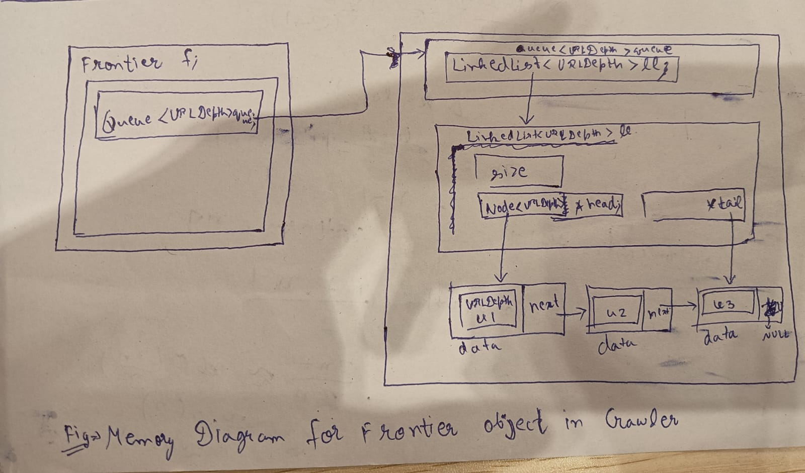

# Frontier Design Proposal

## Overview

The **Frontier** is the scheduling component of the web crawler. Its primary responsibility is to maintain the collection of web pages that have been discovered but have not yet been crawled. Every element stored in the Frontier is represented by a **URLDepth** object, which contains both the normalized URL and its corresponding crawl depth. Keeping these two values together ensures that scheduling information always remains synchronized throughout the crawling process.

During execution, the crawler repeatedly removes a URL-depth pair from the Frontier, downloads the corresponding web page, extracts hyperlinks, and inserts newly discovered pages back into the Frontier. This process continues until the Frontier becomes empty or a predefined crawling limit, such as the maximum crawl depth or maximum page count, is reached.

The Frontier follows the **First-In-First-Out (FIFO)** scheduling strategy, producing a **Breadth-First Search (BFS)** traversal. BFS processes web pages level by level, ensuring that all pages at a smaller crawl depth are visited before pages at a larger depth. This strategy provides systematic website coverage and simplifies crawl-depth management.

To efficiently support FIFO operations, the Frontier is implemented using a reusable **Queue** data structure. The Queue internally reuses the **LinkedList** implementation developed in Project 01. The LinkedList maintains both **head** and **tail** pointers, allowing insertion at the rear (`enqueue`) and removal from the front (`dequeue`) to execute in **O(1)** time.

The Queue itself is implemented as a reusable template data structure rather than embedding queue logic directly inside the Frontier. This separation improves modularity and allows the Queue implementation to be reused in future projects without modification.

The Frontier stores **URLDepth objects by value**, meaning each queue node owns its scheduling information directly. This design eliminates pointer lifetime issues, simplifies memory management, and avoids unnecessary heap allocations for individual URLDepth objects.

The Frontier is intentionally designed with a single responsibility: **managing the crawl order of discovered pages**. It does not validate URLs, normalize URLs, detect duplicates, download web pages, parse HTML, or store crawled content. These responsibilities belong to dedicated crawler components such as the **URL Normalizer**, **SeenStore**, **HTML Parser**, **Downloader**, and **Page Storage**. This separation of responsibilities improves modularity, maintainability, and future extensibility.

---

# Section 1 – Public API

## URLDepth Class

Every entry stored in the Frontier is represented by a `URLDepth` object. This class encapsulates the normalized URL and its corresponding crawl depth. Keeping these two pieces of information together ensures that scheduling information always remains synchronized throughout the crawling process.

```cpp
class URLDepth
{
public:
    string url;
    int depth;

    URLDepth(const string& url, int depth);

    bool operator==(const URLDepth& other) const;
};
```

### Design Justification

The crawler always requires both the URL and its associated crawl depth when scheduling and processing web pages. Encapsulating these values inside a dedicated class improves readability and type safety while treating each URL-depth pair as a single logical entity.

A parameterized constructor simplifies the creation of URLDepth objects throughout the crawler. The overloaded equality operator allows URLDepth objects to be compared directly, enabling reuse with generic data structures such as `LinkedList`, `Queue`, and `DynamicArray` whenever object comparison is required.

The data members are declared **public** because URLDepth is a lightweight data container whose purpose is simply to group related information. This avoids unnecessary getter and setter functions while keeping the implementation simple and efficient.

---

## Frontier API

```cpp
class Frontier
{
public:
    void push(const URLDepth& item);

    URLDepth pop();

    URLDepth front() const;

    bool empty() const;

    int size() const;

private:
    Queue<URLDepth> queue;
};
```

### API Justification

The Frontier exposes only the operations required by the crawler.

- `push()` inserts a newly discovered URL-depth pair into the scheduling queue.
- `pop()` removes the next URL to be crawled.
- `front()` allows inspection of the next scheduled page without removing it.
- `empty()` determines whether additional pages remain to be crawled.
- `size()` returns the number of scheduled URL-depth pairs and is useful for monitoring, debugging, and benchmarking.

The crawler never requires random access, searching, or deletion from arbitrary positions. Therefore, these operations are intentionally omitted to keep the interface minimal and focused.

---

## Queue API

The Frontier internally depends on a reusable Queue data structure.

```cpp
template<typename T>
class Queue
{
public:
    void enqueue(const T& value);

    T dequeue();

    T& front();

    bool empty() const;

    int size() const;

private:
    LinkedList<T> list;
};
```

### Queue Design Justification

The Queue is implemented as an independent reusable data structure instead of embedding queue operations directly inside the Frontier. This separation allows the Queue to be reused by future projects while keeping the Frontier focused solely on crawl scheduling.

The Queue reuses the LinkedList implementation developed in Project 01 instead of introducing another storage mechanism.

Internally, Queue operations directly reuse LinkedList operations:

| Queue Operation | LinkedList Operation |
|-----------------|----------------------|
| `enqueue()` | `push_back()` |
| `dequeue()` | `pop_front()` |
| `front()` | `getHead()` |
| `empty()` | `getSize() == 0` |
| `size()` | `getSize()` |

The LinkedList has been extended with both **head** and **tail** pointers.

This allows:

- O(1) insertion at the rear.
- O(1) removal from the front.

These operations perfectly match the access pattern required by a FIFO queue.

A `DynamicArray` implementation was considered. However, removing the first element requires shifting every remaining element, making `dequeue()` an **O(n)** operation. Since crawling continuously inserts and removes URLs, a LinkedList provides significantly better performance for this workload.

---

# Section 2 – Internal Representation

The Frontier stores URL-depth pairs using the following hierarchy.

```text
Crawler
   │
   ▼
Frontier
   │
   ▼
Queue<URLDepth>
   │
   ▼
LinkedList<URLDepth>

head ──► [URLDepth | next] ──► [URLDepth | next] ──► nullptr
                                         ▲
                                         │
                                        tail
```

Each LinkedList node stores one complete `URLDepth` object.

```text
+--------------------------------------------------+
|               Node<URLDepth>                     |
+--------------------------------------------------+
| URLDepth data                                   |
|--------------------------------------------------|
| string url                                      |
| int    depth                                    |
|--------------------------------------------------|
| Node<URLDepth>* next                            |
+--------------------------------------------------+
```

The URL and crawl depth are stored together because both values are always required while processing a page. Separating them into different containers could introduce synchronization errors and increase implementation complexity.

The Frontier stores `URLDepth` objects **by value**, ensuring that every queue node owns its scheduling information independently without relying on external memory.

### Memory Diagram



---

# Section 3 – Failure Handling

The Frontier handles only queue-related failures. Responsibilities such as URL validation, duplicate detection, HTML parsing, and page downloading belong to other crawler components.

## Empty Frontier

Calling `pop()` or `front()` on an empty Frontier is an invalid operation.

**Design Decision**

- The underlying Queue throws a `std::underflow_error`.
- The Frontier propagates the exception to the caller without modifying its internal state.

## Memory Allocation Failure

If memory allocation fails while inserting a new URL-depth pair, the underlying Queue propagates `std::bad_alloc`.

The Frontier remains unchanged, ensuring that all previously scheduled URLs remain intact.

## Invalid URL

The Frontier assumes that every inserted URL has already been validated and normalized by the **URL Normalizer**.

No URL validation is performed inside this component.

## Duplicate URL

Duplicate detection is intentionally delegated to the **SeenStore**.

The Frontier accepts every URL passed to `push()` because preventing duplicate scheduling is outside its responsibility.

## Queue Overflow

Not applicable.

The Queue grows dynamically as long as sufficient memory is available.

---

# Section 4 – Complexity Analysis

Since the Queue is implemented using a LinkedList that maintains both head and tail pointers, insertion at the rear and removal from the front both execute in constant time.

| Operation | Best | Average | Worst |
|-----------|------|---------|-------|
| `push()` | O(1) | O(1) | O(1) |
| `pop()` | O(1) | O(1) | O(1) |
| `front()` | O(1) | O(1) | O(1) |
| `empty()` | O(1) | O(1) | O(1) |
| `size()` | O(1) | O(1) | O(1) |

### Space Complexity

| Structure | Complexity |
|-----------|------------|
| Frontier | O(n) |

where **n** is the number of scheduled `URLDepth` objects currently stored in the Frontier.

---

# Section 5 – Future Compatibility

The Frontier exposes only high-level scheduling operations while hiding the underlying Queue implementation. Consequently, future implementations may replace the current LinkedList-based Queue without affecting the crawler or other system components.

Possible future improvements include:

- Replacing the FIFO queue with a priority-based Frontier for importance-driven crawling.
- Using a disk-backed Frontier to support extremely large crawl workloads.
- Making the Frontier thread-safe for multi-threaded crawlers.
- Implementing a distributed Frontier shared among multiple crawler instances.

Since the crawler interacts exclusively through the Frontier API, these enhancements can be introduced without changing the public interface or modifying crawler logic.